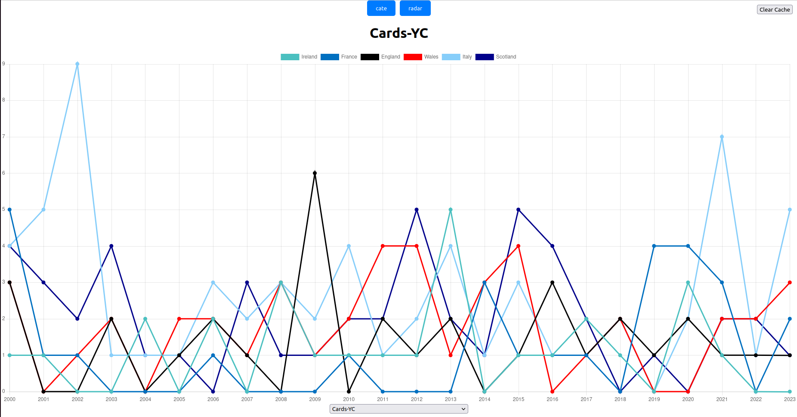

# App React

Maintenan qu'on a les datas et l'api, nous pouvons passer a l'affichage des stats via deux graphiques : courbes et radar, avec la lib [chart.js](https://www.chartjs.org/).

## Sommaire

- [Lancer le Dashboard](README.md#lancer-le-dashboard)
- [Fontionnement du Dashboard](README.md#fontionnement-du-dashboard)
- [Graphique Courbes](README.md#graphique-courbes)
- [Graphique Radar](README.md#graphique-radar)

## Lancer le Dashboard

 - Aller a la racine du projet React :
    ```bash
    cd frontdata6nations/
    ```

- Installer les dépendances :
    ```bash
    npm install
    ```
- Avoir l'[API](../API/) de lancer lors du premier lancement de l'app

- lancer l'app 
    ```bash
    npm start
    ```

- [doc React](/AppReact/frontdata6nations/DocReact.md) 

## Fontionnement du Dashboard

En premier lieu le Dashboard pour chaque équipes verifi si leurs statistiques sont bien enregistrer dans le local storage, sinon il requette l'api pour les recuperer et les stocker. Une fois les données initialiser chaque graphique récuperent les datas via le local storage pour éviter des requetes en masse sur l'api. Arriver la page vous avez le choix, via les bouton bleu en haut, de choisir d'afficher soit le [cate](README.md#graphique-courbes), soit le [radar](README.md#graphique-radar). Chaque graphique est independant de l'autre.

## Graphique Courbes

Comme dit plus haut le graphique Courbes, dit cate, récupere les datas de chaques équipes de chaques années par rapport a une statistiques, cela veut dire par exemple, qu'il recupere toutes les données des cartons jaunes de chaque année pour chaque équipe et les affiches sous forme d'un graphique courbe :



De plus vous pouvez choisir qu'elle statisque afficher parmit toutes les statisques que l'api propose via le sélécteur en bas de la page

## Graphique Radar

